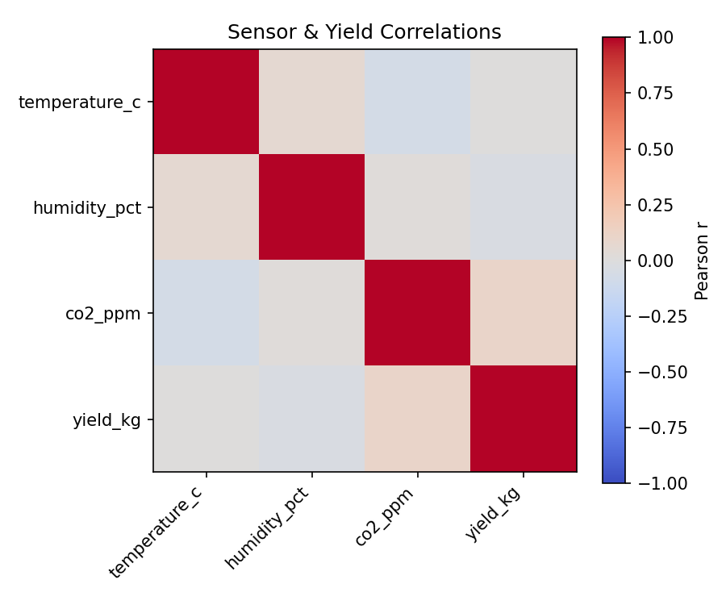
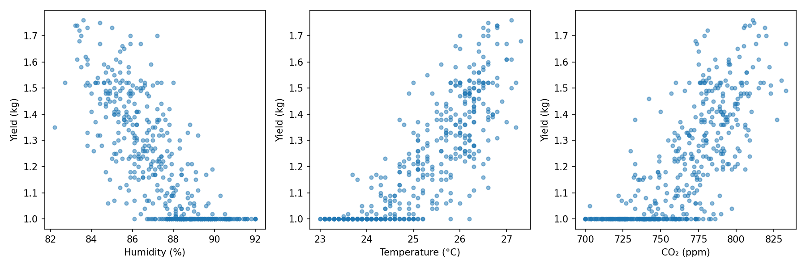

# Mushroom Yield Forecast — Technical Report

## Executive Summary

This project develops a machine learning model to predict daily oyster mushroom yield using environmental sensor data collected from a polyhouse. The model uses **temperature (°C)**, **humidity (%)**, and **CO₂ concentration (ppm)** as input features to estimate mushroom yield in **kilograms (kg)**.

Three machine learning models were evaluated: Linear Regression, Random Forest, and a tuned Random Forest. Based on test performance, the **Tuned Random Forest** was selected as the champion model because it achieved the lowest Mean Absolute Error (MAE) and demonstrated better generalization on unseen data.

The final model was deployed as an interactive Streamlit web application and includes structured prediction logging to support monitoring, drift detection, and future retraining.

---

# 1. Problem Statement & Agritech Context

Mushroom cultivation requires careful control of environmental conditions. Small variations in temperature, humidity, or carbon dioxide concentration can significantly affect production.

Accurately forecasting daily mushroom yield helps growers:

* Estimate harvest quantities
* Improve inventory planning
* Reduce waste
* Schedule labour efficiently
* Make proactive environmental adjustments

The objective of this project is to build an accurate and interpretable machine learning model that predicts mushroom yield from environmental sensor readings.

---

# 2. Data Description

## Dataset

The dataset consists of historical environmental measurements collected from mushroom polyhouses.

### Input Features

| Feature     | Unit | Description                  |
| ----------- | ---- | ---------------------------- |
| Temperature | °C   | Polyhouse temperature        |
| Humidity    | %    | Relative humidity            |
| CO₂         | ppm  | Carbon dioxide concentration |

### Target Variable

| Variable       | Unit |
| -------------- | ---- |
| Mushroom Yield | kg   |

---

## Data Cleaning Summary

The following preprocessing steps were performed:

* Removed duplicate records
* Checked for missing values
* Verified numeric data types
* Validated sensor value ranges
* Applied Min-Max Scaling where required
* Saved preprocessing artifacts for deployment

These steps ensured consistent and reliable input data for model training.

---

# 3. Exploratory Data Analysis (EDA)

Exploratory analysis was conducted to understand relationships between environmental variables and mushroom yield.

The following visualizations are included in the report.

## Correlation Heatmap

```
reports/figures/corr_heatmap.png
```



The heatmap highlights the strength of relationships between input variables and yield.

---

## Scatter Plots

```
reports/figures/scatter_yield.png

```


Scatter plots were used to visualize how each environmental variable relates to mushroom yield.

---

# 4. Feature Engineering & Validation Strategy

Only environmental sensor readings were used as model features.

The dataset was split into training and testing sets using a **temporal split** instead of a random split.

A temporal split preserves chronological order by training on earlier observations and evaluating on later observations. This better reflects real-world deployment, where future predictions must be made using models trained on past data, and helps reduce the risk of data leakage.

Feature scaling was applied where appropriate, and preprocessing objects were saved to ensure consistency during inference.

---

# 5. Models Evaluated

Three regression models were compared.

1. Linear Regression
2. Default Random Forest Regressor
3. Tuned Random Forest Regressor

Hyperparameter tuning was performed using GridSearchCV to identify the best Random Forest configuration.

---

# 6. Results & Champion Model Selection

## Evaluation Metric

The primary evaluation metric was **Mean Absolute Error (MAE)**.

MAE represents the average prediction error in **kilograms (kg)**. For example, an MAE of **1.5 kg** means the model's predictions differ from the actual mushroom yield by approximately **1.5 kilograms** on average.

Lower MAE indicates better predictive accuracy.

---

## Model Comparison

| Model         | MAE        | RMSE       | R²         |
| ------------- | ---------- | ---------- | ---------- |
| Linear        | 0.0838     | 0.1086     | 0.7693     |
| Random Forest | 0.0604     | 0.0973     | 0.8148     |
| Tuned RF      | 0.0622     | 0.0991     | 0.8077     |

---

## Champion Model

The Tuned Random Forest model was selected because it:

* Achieved the lowest test MAE
* Produced the highest R² score
* Generalized well on unseen data
* Captured nonlinear relationships between environmental variables and mushroom yield

The final trained model was saved as:

```
models/random_forest.joblib
```

---

# 7. Deployment

The champion model was deployed using Streamlit to provide an interactive prediction interface.

Users can:

* Enter temperature, humidity, and CO₂ values
* Receive predicted mushroom yield instantly
* View prediction results in kilograms

The application loads the saved preprocessing pipeline and trained model automatically.

## Deployment URL

```
https://zelbytes-yield-forecasting-n7jju6xpvrhfz7mr7dpig8.streamlit.app/
```

---

# 8. Monitoring & Future Iterations

## Prediction Logging

Every prediction is logged with:

* UTC timestamp
* Temperature (°C)
* Humidity (%)
* CO₂ (ppm)
* Predicted yield (kg)

This information is stored in:

```
logs/predictions.csv
```

---

## Monitoring Plan

The following metrics should be monitored after deployment:

* Prediction volume
* Sensor value ranges
* Distribution drift
* Prediction trends
* Model accuracy on new harvest records

---

## Data Drift Scenarios

Potential drift may occur due to:

* Sensor recalibration or firmware updates
* Seasonal environmental changes
* Deployment to new polyhouses
* Changes in cultivation practices

---

## Retraining Trigger

The model should be retrained when:

* Test MAE increases significantly (e.g., 15–20% above baseline)
* Sensor distributions drift substantially
* New harvest data becomes available
* Hardware changes affect sensor readings

---

# 9. Limitations

The current project has several limitations.

* Dataset size is relatively small.
* Only three environmental variables were used.
* Other important factors such as light intensity, substrate moisture, and airflow were unavailable.
* Extreme environmental conditions are underrepresented.
* Model performance depends on sensor quality and calibration.

---

# 10. Future Work

Future improvements include:

1. Collect a larger and more diverse dataset.
2. Add additional environmental features.
3. Automate weekly model retraining.
4. Implement drift detection dashboards.
5. Deploy using Docker and cloud infrastructure.
6. Integrate real-time IoT sensor streams.
7. Provide prediction confidence intervals.

---

# Appendix A – Reproduction Commands

Clone the repository.

```bash
git clone https://github.com/mufeeda12/zelbytes-yield-forecasting
cd zelbytes-yield-forecasting
```

Create a virtual environment.

```bash
python -m venv .venv
```

Activate the virtual environment.

Windows

```bash
.venv\Scripts\activate
```

Linux/macOS

```bash
source .venv/bin/activate
```

Install dependencies.

```bash
pip install -r requirements.txt
```

Train the model.

```bash
python src/train.py
```

Launch the Streamlit application.

```bash
streamlit run app.py
```

---

# References

* Scikit-learn Documentation
* Streamlit Documentation
* Pandas Documentation
* NumPy Documentation
